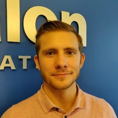

# Resumé

## About
I am a very dedicated system developer at work as well as in my free time. I'm versatile and capable of building complete systems with electronics/embedded software, user interfaces and backend solutions combined.

### Most proud of

My ability to formulate improvements to existing systems. 
Delivering real improvement and adding value beyond what's expected of me.
My passion and drive to create solutions and software in my spare time. 

## Projects and Assignments

### 2019 - Ongoing, Power Comp, personal project/product

- Role: Architect and developer
- Tools: Angular, NestJS, Typescript, Socket IO, TypeORM, Sqlite, Nx monorepo, Electron, Docker

The rewritten version of my hobby project for the Southern Swedish Powerlifting Federation (SSSF).
This is now a subscription based product that I sell and has been adopted by multiple federations, even internationally. 
It is a competition management system for powerlifting. It is web based where the server is locally run (to enable offline use on a local router if multiple clients are needed) but it is also dockerized for cloud hosting. A web interface written in Angular is served to clients and is updated in real time using Socket IO, the backend is written with the framework NestJs and uses TypeORM to manage the database. The system handles registration of athletes, general competition configuration, audience scoreboards and more. The repo is organized with Nx monorepos for code sharing between the frontend and backend. Live demo available at http://pcms2.dahlgren.tech. This software is actively worked on and is currently clocking at 500+ hours.

### 2021-06 - Ongoing, Play'n GO, 100% remote

- Role: Backend developer
- Tools: C#.NET, ASP.NET Core, Angular/NodeJs/Typescript, MySQL, Visual Studio, Git, Octopus Deploy.

I am part of a team that develops and maintains PlayNGo’s leaderboard feature (backend). Much of
my work consists of adding new features to their services. I was also part of
creating a user interface made in Angular that interacts with their backend services.
The team I work in consist of 10 people, where we work in an agile manner with a Kanban board.

### 2021-02 - 2021-06, Skolon, 100% remote

- Role: Backend developer
- Tools: Node js, Express, Mysql, Java.

Maintained Skolons existing user data synchronization software (NodeJS/Express) as well as building integrations to new clients.
Also assisted updating their Java backend needed for their migration from Google App Engine to Java Spring.

### 2020-10 - 2021-01, Precure

- Role: Fullstack developer
- Tools: Visual Studio, Xamarin.Forms, C#/.NET, Cross Platform BLE/GATT, Git

Was responsible for adapting an existing app to allow communication between the customer’s new product and the app. I also made architectural changes making the app more scalable and maintainable. I worked closely with the embedded software/electronics team as we had to make shared Bluetooth interface specifications.

### 2020-02 - 2020-09, Axis Communication

- Role: Backend developer
- Tools: Visual Studio 2019, C#/.NET, WPF

Was part of a team that integrates cameras that Axis has made into their PC software called Axis Camera Station. We mainly worked on integrating a new product called Axis body worn solution. The software was a very large codebase written in C#.NET and WPF using AutoFac for dependency injection.

### 2019-04 - 2020, Hobby / Southern Swedish Powerlifting Federation

- Role: System Developer
- Tools: Angular 9, ExpressJs, Typescript, Node.js, Socket IO, Git

I created a competition management system from scratch as a side project in my spare time for the Southern Swedish Powerlifting Federation. It is a web based application where the server is locally run (to enable offline use on a local router if multiple clients are needed). A web interface written in Angular 9 is served to clients and is updated in real time using Socket IO. The system handles registration of athletes, general competition configuration, audience scoreboards and much more. The backend was written with Express. Writing both the backend and frontend in the same language allowed fast development where shared type definitions and helper functions could be used on both ends of the system. The first iteration took about 200 hours to build.

### 2017-2019, BorgWarner

- Role: Software Developer
- Tools: Visual Studio, C#.NET, WPF, CAN/FlexRay, Canalyzer, Git

I was hired to maintain existing software/tools (DLL and Windows Form Application) used by BorgWarner software developers and in BorgWarner’s production line. The software was poorly managed/written and scattered across multiple projects with repeating code that was copied and pasted.

To solve this I created a new system/software from scratch when BorgWarner needed new tools for their latest line of products. The software was written in C# and was created with reusability and modularizing in mind and has multiple layers of abstraction to make software components interchangeable (e.g. using Ethernet instead of CAN or FlexRay). The GUI was created with Windows Presentation Foundation (WPF) to make a more responsive design than before (Win Form).

### 2016-10-01 - 2017-03-08, Prevas AB / Helsingborgs Stad

- Role: Software Developer
- Tools: Visual Studio, ASP.NET, Sql Server, Git

Worked on improvements requested by Helsingborgs Stad for their web application for handling maintenance on their real estates called Fasit. The improvements involved modifying the database (SQL Server), the server controllers (C#/VB/ASP.NET) and the client side web pages (HTML and Javascript).

### 2016-09-01 - 2017-03-08, Prevas AB

- Role: Software Developer

I developed a webpage that serves as a welcome screen for the Prevas Malmö Office. The screen displays photos from Prevas AB's official Instagram account, press releases, ongoing projects, the internal office calendar and more. The screen gets its data from a system called PEZ and it is also administered from PEZ. The data PEZ provides is fetched from various sources such as RSS feeds, the Instagram API and data stored in the systems database. The webpage use HTML, CSS (Bootstrap) and Javascript and the backend is developed with C#.NET / ASP.NET MVC

### 2016-10-01 - 2017-01-15, Hobby / HAK Greppet

I created wireless controllers and receivers for a Competition Management System for the olympic weightlifting club HAK Greppet. The design included programming ATMEGA32 microcontrollers and using NRF24L01+ transceivers. A custom PCB was designed in EAGLE 7.7 and finally soldered the various components together and mounted them in prototype cases.

## Employment history

### 2019 - Current, Avalon Innovation

Consultant / Software Developer

### 2016 - 2019, Prevas AB

Consultant / Software Developer. 

Was employed part time from 2014 while studying Computer Science and switched to fulltime once I completed my studies.

## Courses

2017, Nohau – Embedded C programming.

## Education

2013-2016, Lunds Tekniska Högskola– Bachelor of Science, Computer Science